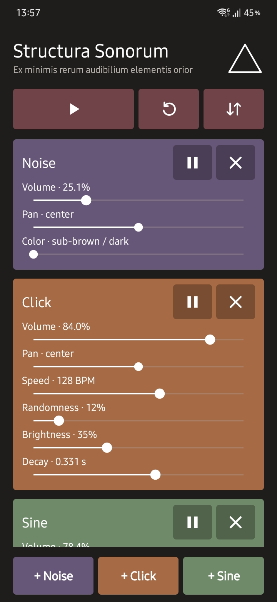

# Structura Sonorum

An Android sound generator with independent noise, impulse, and sine generators. Each generator has its own volume, pan, sound controls, and mute button. No samples, ads, accounts, or network permission. The only permission requested is permission to show notifications, used to display the triangle in the notification bar and provide Play, Pause, and Exit controls. Settings are saved on every change. Playback does not start automatically when the app opens. Generators of the same kind appear together.

  

<em>Structura Sonorum running on a Samsung Galaxy S25+ with Android 16.</em>

## The triangle

The three generator types represent simplified extremes of audible phenomena. Noise stands for all frequencies at all times. An ideal impulse has frequency content everywhere but, ideally, no duration. A sine stands for one frequency sustained through time. They form the three points of the Structura Sonorum triangle; every possible sound can be imagined as occurring somewhere between them. This is deliberately a simplified model, but it provides a workable foundation for the application.

The outlined triangle used as the launcher icon and header logo expresses this relationship. Tapping the header logo shows the version, author and website.

## Controls

- Noise: sub-Brownian/dark at 0%, Brownian at 25%, pink at 65%, and white/bright at 100%. The color control has 0.1% steps and extra sensitivity near the dark end. Slow level normalization compensates for energy lost through heavy filtering, while the white end is attenuated to reduce its greater perceived loudness. The separate volume control also has 0.1% steps.
- Impulse: speed is 20–200 BPM. Randomness ranges from regular spacing to exponentially distributed intervals. Brightness ranges from a low drum-like tone to a short bright transient. Decay runs logarithmically from a 3 ms impulse to a 10 second fade; long decays can overlap.
- Sine: coarse frequency runs logarithmically from 25 Hz to 15 kHz. Fine frequency offsets −25 to +25 Hz in 0.1 Hz steps, centered at zero. The total frequency label updates with both controls. Fluctuation adjusts pitch modulation from 0 to ±100 Hz; its speed ranges logarithmically from 0.1 to 100 Hz and is displayed in both Hz and BPM. At high modulation speed it may sound like FM rather than a slow wobble.
- Every generator has equal-power stereo pan from −100% (left) to +100% (right), centered initially. Extreme opposite pan settings can be used for separate sine frequencies in the two ears. The matching pause/play icon mutes or unmutes a generator; the X icon removes it. Initially there is one generator of each kind, with pan and sine fine frequency centered, all other sliders at the left, and playback paused.

Start with the phone/headphone volume low, especially when testing impulses and high sine frequencies. This app is not active noise cancellation and does not adapt to incoming sound.

The notification stays present while playback is paused; it can resume playback, mute or unmute output while playing, or exit. Its compact layout requests both actions, but their visibility is controlled by Android and the phone manufacturer. Exit closes playback and the app task. Reset restores three silent generators after confirmation. Remove asks before deleting a generator. The two arrows button offers Import and Export. Export saves a JSON backup directly to Downloads on Android 10 and newer, with a name such as `△-2026-09-18-21-45-00.json`. Android 8–9 opens the system file picker to save instead. Import uses the Android file picker, validates the selected backup, then asks before replacing the current configuration. Older backups remain compatible. Import stops playback and closes its notification; tap Play to hear the imported configuration. The version shown in `app/build.gradle` is increased with each delivered source build.

## Build an installable APK in Android Studio

This project is configured for **Gradle 8.13** and **Android Gradle Plugin 8.13.2**. Install Android Studio with Android SDK Platform 35. Open the `StructuraSonorum` folder as a project, then in **Settings → Build, Execution, Deployment → Build Tools → Gradle**, choose a local Gradle 8.13 distribution and Android Studio’s bundled JDK (JBR 17 or newer). The project does not contain a Gradle wrapper JAR, so Android Studio needs your local Gradle installation. A first sync when opening a newly extracted project is normal.

Select **Build → Build Bundle(s) / APK(s) → Build APK(s)**. The generated debug APK is at `app/build/outputs/apk/debug/app-debug.apk`. It is installable on Android 8.0 or newer; you may need to allow installation from the app you use to open the APK. This debug APK is signed with Android's automatically generated debug key. If you need a lasting release identity for future updates or Play Store distribution, use **Build → Generate Signed Bundle / APK**, create and securely retain your own keystore, and select APK. Do not lose that keystore: future updates must use the same signing key.

Alternatively, after installing the SDK and Gradle 8.13, run `gradle :app:assembleDebug` inside this folder. The local Android SDK should be configured through Android Studio or `ANDROID_HOME`. Do not distribute an unsigned release APK.

## Tested devices

Version 1.10 was compiled successfully and tested on two Android 16 devices:

- Samsung Galaxy S25+ — One UI 8.5
- Samsung Galaxy Tab S8+ — One UI 8.0

The app runs well on both devices. Testing on these devices does not guarantee identical behavior on every Android device or manufacturer configuration.
